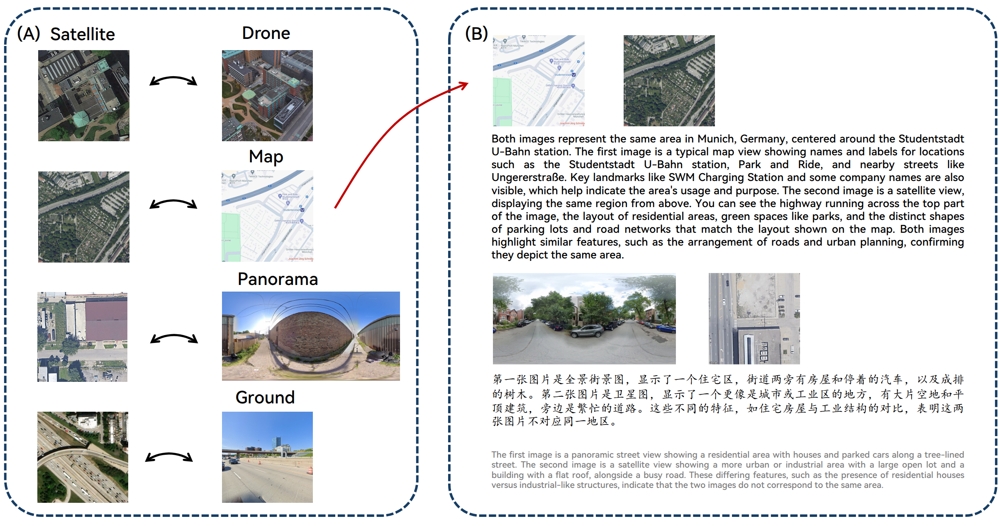

# GLEAM: Learning to Match and Explain in Cross-View Geo-Localization

This repository contains the official implementation of **GLEAM**, a foundational pipeline for Cross-View Geo-Localization (CVGL) that unifies multi-modal and multi-view alignment with explainable reasoning. GLEAM consists of two core components:

- **GLEAM-C (A)**: A foundational CVGL model that aligns multiple views and modalities (UAV, street maps, panoramas, ground photos) with satellite imagery through efficient two-phase training.
- **GLEAM-X (B)**: A novel task that extends cross-view matching with explainable reasoning using multimodal large language models (MLLMs), supported by a bilingual benchmark.

## 🧠 Overview

Traditional CVGL methods are often limited to single views or modalities and lack interpretability. GLEAM addresses these limitations by:

- Unifying multiple geographic views and modalities into a single alignment framework.
- Introducing explainable reasoning into cross-view geo-localization via MLLM-powered analysis.
- Providing a bilingual (English/Chinese) benchmark for training and evaluating explainable CVGL systems.

## 🏗️ Framework

### GLEAM-C
GLEAM-C aligns diverse geographic views with satellite imagery through:
- Optimized implementation for efficient training.
- A two-phase training strategy achieving accuracy comparable to prior modality-specific models.

### GLEAM-X
GLEAM-X introduces a new task combining cross-view correspondence prediction with natural language explanations. It includes:
- A bilingual dataset generated using GPT-4o and Doubao-1.5-Thinking-Vision-Pro.
- A human-refined test set for systematic evaluation of explainable reasoning.

---
> 🔔 **Note**: This repository is under active development. Code and data will be fully released upon acceptance.

